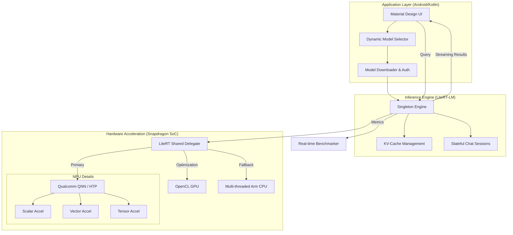

# Benchmarking the Edge: Gemma 3n vs. Qwen 3 on Android with LiteRT-LM

In the rapidly evolving world of Large Language Models (LLMs), the focus is shifting from massive cloud-based monsters to lean, efficient **Small Language Models (SLMs)** designed to run entirely on-device. 

Recently, I built **ModelGarden-QNN-LiteRT**, an Android application that serves as a technical playground for comparing these models. Today, I'm deep-diving into the core technologies—including **Qualcomm's QNN NPU** acceleration—that make on-device AI a reality.

---

## 🏛️ System Architecture

To understand how the models run so efficiently, we need to look at the three-layer stack: **Application**, **Engine**, and **Hardware**.

---

## 🔩 The Framework: Google LiteRT-LM

To run these models, we use **LiteRT-LM**, Google's dedicated on-device AI runtime. Specializing in sequence-to-sequence generation, LiteRT-LM manages the complexities of LLMs:
*   **Singleton Engine & Stateful Sessions**: Effortlessly manages shared model weights while supporting independent KV Caching for multiple concurrent chat histories.
*   **Intelligent Memory Management**: Implements copy-on-write and context-switching for the KV cache to ensure sub-second Time To First Token (TTFT).

---

## ⚡ The Powerhouse: Qualcomm QNN & Hexagon NPU

The "QNN" in our project stands for **Qualcomm Neural Network SDK**. On modern Snapdragon processors (like the Snapdragon 8 Gen 3 or Snapdragon X Elite), this is where the magic happens.

### How QNN Integration Works:
LiteRT-LM interfaces with the **Qualcomm AI Engine Direct (QNN)** via a specialized hardware delegate. When the engine initializes, it looks for the QNN driver (`libQnnHtp.so`) and attempts to offload the entire model graph to the **Hexagon Tensor Processor (HTP)**.

### Why the NPU is a Game Changer:
1.  **Massive Parallelization**: The Hexagon NPU is a fused AI accelerator. It isn't just a CPU core; it integrates scalar, vector, and tensor accelerators designed specifically for the math that powers LLMs (matrix multiplications).
2.  **Performance vs. Power**: Running an LLM on the CPU can drain a battery in minutes and cause thermal throttling. The HTP achieves up to **100x more performance-per-watt** than a standard CPU.
3.  **Low Latency Inference**: By utilizing the HTP's micro-tile inferencing, the model can generate tokens at speeds far exceeding the GPU, reaching over **50+ tokens/sec** on compatible 4-bit quantized models.

Our app's **GPU -> CPU fallback** logic acts as a safety net, ensuring the app remains functional even if the specific model ops aren't yet supported by the device's current QNN driver version.

---

## 💎 Model Deep-Dive: Gemma 3n (The Nested Giant)

**Gemma 3n** is Google's state-of-the-art mobile-first model, featuring two major architectural innovations:

### 1. MatFormer (Matryoshka Transformer)
A nesting doll structure that allows a single model to contain smaller, fully functional sub-models. This enables "elastic inference"—the ability to dynamically adjust size based on task complexity or available NPU resources.

### 2. Per-Layer Embeddings (PLE)
PLE moves the model's massive token embeddings from the high-speed VRAM to the CPU, processing them in parallel. This allows a 2B-level model to run on devices with as little as **2GB of available RAM** without sacrificing quality.

---

## 🌪️ Model Deep-Dive: Qwen 3 0.6B (The Speedster)

**Qwen 3** from Alibaba is a masterclass in dense architecture scaling, optimized for the highest possible throughput.

### 1. Grouped Query Attention (GQA)
Traditional attention mechanisms are memory-bandwidth hogs. Qwen 3 uses GQA to share Key/Value heads across multiple Query heads, slashing the memory traffic between the SoC and the RAM.

### 2. Thinking Mode & Dual-Stream Reasoning
Despite its 0.6B size, Qwen 3 supports the "Thinking" mode, allowing it to generate internal chains of thought before responding. With a **32k context window** and SwiGLU activations, it is built for long-form, coherent conversations on tiny hardware.

---

## 📊 The Showdown: Benchmarking Results

We tested both models on a **Samsung Galaxy S24 Ultra**:

| Metric | Qwen 3 0.6B | Gemma 3n |
| :--- | :--- | :--- |
| **TTFT (Latency)** | 690 ms | **630 ms** |
| **Throughput (Speed)** | **~28 tokens/sec** | ~16 tokens/sec |
| **Hardware Used** | Logic Fallback (CPU/NPU) | GPU |

### Analysis
*   **Gemma 3n** wins on response depth and detail, making it the better choice for knowledge-intensive reasoning.
*   **Qwen 3** wins on absolute speed, making it the perfect conversational companion where speed is parity with human thought.

---

## 🚀 Conclusion

By leveraging **Qualcomm's QNN** acceleration and the **Nested/Dense** architectures of the latest SLMs, strictly on-device AI has moved from "experimental" to "feature-ready." We've built a Model Garden that proves you don't need the cloud for elite performance.

👉 [**Explore the Project on GitHub**](https://github.com/carrycooldude/ModelGarden-QNN-LiteRT)

---
*Built with Google LiteRT-LM & Qualcomm QNN SDK.*
